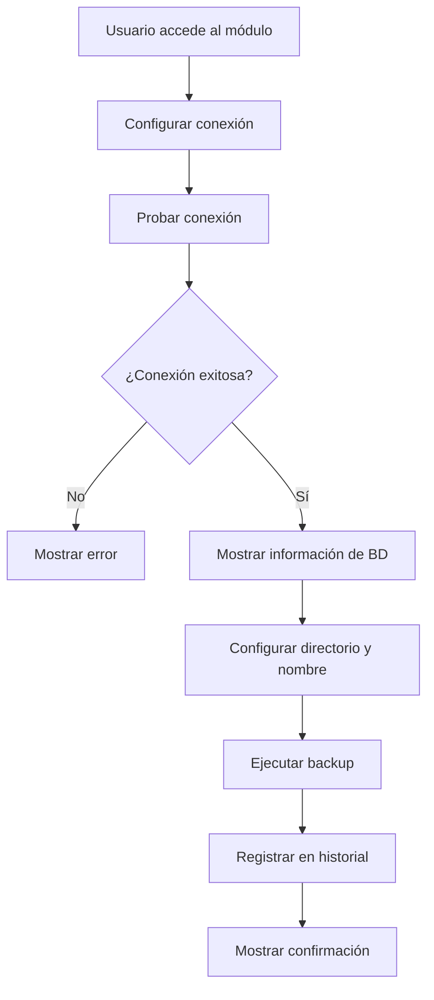
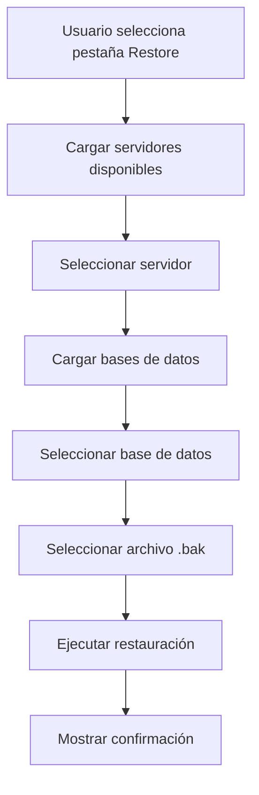

# Análisis de Funcionamiento y Lógica de Procedimiento - Módulo de Backup

## 1. **Análisis Estructural Actual del Sistema**

### 1.1 Arquitectura Existente
- **Frontend**: React con Material-UI
- **Backend**: Node.js con Express
- **Base de Datos**: MySQL
- **Patrón**: MVC (Model-View-Controller)
- **Autenticación**: JWT con middleware de autorización

### 1.2 Estructura de Navegación Actual
- SideBar con menú de administración
- Sección de Backup ya definida en la navegación
- Rutas protegidas para administradores

## 2. **Análisis de las Pantallas de Referencia**

### 2.1 Pantalla 1: "Respaldar base de datos"
**Características identificadas:**
- **Sección Izquierda**: Configuración de conexión
  - Servidor: (local)
  - Base de datos: master
  - Usuario: sa
  - Contraseña: ********
  - Botón "Probar conexión" con validación visual
  - Indicador de estado (ícono verde/rojo)
  - Mensaje de confirmación

- **Sección Derecha**: Información y configuración del backup
  - Información de la BD (nombre, tamaño, espacio no asignado)
  - Directorio de destino con botón de navegación
  - Nombre del archivo editable
  - Botón "Respaldar" principal

### 2.2 Pantalla 2: "Crear BACKUP y RESTORE"
**Características identificadas:**
- **Navegación por pestañas**: Backup | Restore
- **Pestaña Restore**:
  - Servidor Local (dropdown)
  - Base de Datos (dropdown)
  - Directorio del archivo .bak
  - Botones: Restaurar | Salir

## 3. **Lógica de Procedimiento Implementada**

### 3.1 Flujo de Creación de Backup



### 3.2 Flujo de Restauración de Backup



### 3.3 Validaciones y Seguridad

**Validaciones implementadas:**
- Autenticación requerida
- Rol de administrador obligatorio
- Validación de conexión antes de backup
- Verificación de existencia de archivos
- Sanitización de parámetros

**Seguridad:**
- Middleware de autenticación
- Middleware de autorización de administrador
- Logging de todas las operaciones
- Manejo seguro de contraseñas

## 4. **Componentes Frontend Creados**

### 4.1 BackupModule.jsx
- **Propósito**: Componente principal con navegación por pestañas
- **Características**:
  - Tabs de Material-UI
  - Diseño responsive
  - Integración con componentes hijos

### 4.2 BackupCreate.jsx
- **Propósito**: Crear backups
- **Características**:
  - Dos secciones: Configuración de conexión | Información y configuración
  - Validación en tiempo real
  - Estados de carga
  - Mensajes de feedback

### 4.3 BackupRestore.jsx
- **Propósito**: Restaurar backups
- **Características**:
  - Dropdowns para servidor y base de datos
  - Selector de archivo .bak
  - Botones de acción (Restaurar | Salir)

### 4.4 backupService.js
- **Propósito**: Servicio para comunicación con backend
- **Métodos**:
  - `testConnection()`: Probar conexión
  - `createBackup()`: Crear backup
  - `restoreBackup()`: Restaurar backup
  - `getAvailableServers()`: Obtener servidores
  - `getAvailableDatabases()`: Obtener bases de datos

## 5. **Componentes Backend Creados**

### 5.1 backupController.js
- **Propósito**: Manejar requests HTTP
- **Endpoints**:
  - `POST /admin/backup/test-connection`
  - `POST /admin/backup/create`
  - `GET /admin/backup/servers`
  - `GET /admin/backup/databases`
  - `POST /admin/backup/restore`
  - `GET /admin/backup/history`
  - `DELETE /admin/backup/:backupId`
  - `GET /admin/backup/download/:backupId`

### 5.2 backupService.js
- **Propósito**: Lógica de negocio
- **Funcionalidades**:
  - Conexión a MySQL
  - Creación de backups con mysqldump
  - Restauración de backups
  - Gestión de archivos
  - Logging de operaciones

### 5.3 backupRoutes.js
- **Propósito**: Definir rutas
- **Características**:
  - Middleware de autenticación
  - Middleware de autorización de administrador
  - Rutas RESTful

### 5.4 adminMiddleware.js
- **Propósito**: Verificar permisos de administrador
- **Validaciones**:
  - Usuario autenticado
  - Rol de administrador

## 6. **Integración con el Sistema Existente**

### 6.1 Rutas del Frontend
```javascript
// En App.js o router principal
<Route path="/admin/backup" element={<BackupPage />} />
```

### 6.2 Rutas del Backend
```javascript
// En server.js
app.use('/admin/backup', require('./Routers/backupRoutes'));
```

### 6.3 Navegación
- Integrado en SideBar.jsx
- Menú de administración
- Rutas protegidas

## 7. **Características Técnicas Implementadas**

### 7.1 Frontend
- **React Hooks**: useState, useEffect
- **Material-UI**: Componentes modernos
- **Responsive Design**: Adaptable a móviles
- **Estado de carga**: Indicadores visuales
- **Validación**: En tiempo real
- **Manejo de errores**: Alertas informativas

### 7.2 Backend
- **MySQL2**: Conexiones asíncronas
- **Child Process**: Ejecución de mysqldump
- **File System**: Gestión de archivos
- **Logging**: Registro de operaciones
- **Error Handling**: Manejo robusto de errores

### 7.3 Base de Datos
- **Conexiones dinámicas**: Múltiples servidores
- **Información de BD**: Tamaño, espacio
- **Historial**: Registro de backups
- **Seguridad**: Validación de permisos

## 8. **Flujo de Usuario Completo**

### 8.1 Crear Backup
1. Usuario accede al módulo de backup
2. Configura parámetros de conexión
3. Prueba la conexión
4. Visualiza información de la base de datos
5. Configura directorio y nombre del archivo
6. Ejecuta el backup
7. Recibe confirmación

### 8.2 Restaurar Backup
1. Usuario selecciona pestaña "Restaurar"
2. Selecciona servidor de destino
3. Selecciona base de datos de destino
4. Selecciona archivo .bak
5. Ejecuta la restauración
6. Recibe confirmación

## 9. **Consideraciones de Seguridad**

### 9.1 Autenticación y Autorización
- JWT token requerido
- Rol de administrador obligatorio
- Middleware de validación

### 9.2 Validación de Datos
- Sanitización de parámetros
- Validación de tipos
- Verificación de permisos de archivo

### 9.3 Logging y Auditoría
- Registro de todas las operaciones
- Información de usuario
- Timestamps de operaciones

## 10. **Mejoras Futuras Sugeridas**

### 10.1 Funcionalidades Adicionales
- Programación automática de backups
- Compresión de archivos
- Envío por email
- Integración con almacenamiento en la nube

### 10.2 Optimizaciones
- Caché de conexiones
- Procesamiento en background
- Notificaciones en tiempo real
- Métricas de rendimiento

### 10.3 Seguridad
- Encriptación de backups
- Rotación de claves
- Auditoría avanzada
- Backup de configuración

## 11. **Conclusión**

El módulo de backup implementado sigue las mejores prácticas de desarrollo y proporciona una interfaz intuitiva similar a las pantallas de referencia. La arquitectura es escalable, segura y mantiene la consistencia con el sistema existente.

**Puntos clave:**
- ✅ Navegación por pestañas implementada
- ✅ Validación de conexión antes de backup
- ✅ Información de base de datos en tiempo real
- ✅ Interfaz moderna y responsive
- ✅ Seguridad robusta
- ✅ Logging completo
- ✅ Manejo de errores
- ✅ Integración con sistema existente 