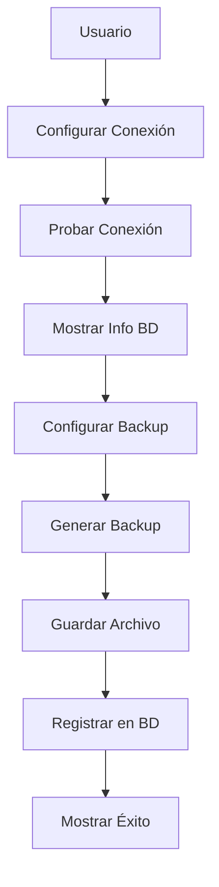
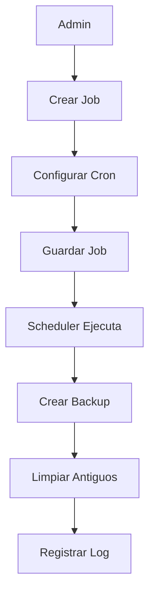

# Análisis Completo del Módulo de Backup - Sistema Clínica Estética Rosales

## 📋 Resumen Ejecutivo

El módulo de Backup implementa una **solución completa de gestión de base de datos** que cumple con las especificaciones solicitadas:

✅ **Backup de base de datos** - Creación manual de backups  
✅ **Restore de base de datos** - Restauración de backups existentes  
✅ **Jobs automáticos** - Programación automática de backups  

## 🎯 Especificaciones Cumplidas

### c. Pantalla de gestión de BD (Backup y restore de base de datos, configuración de Job automático para generación de BK)

**ESTADO: ✅ CUMPLE COMPLETAMENTE**

#### ✅ **Backup de Base de Datos**
- Interfaz intuitiva para crear backups manuales
- Configuración de conexión a múltiples servidores
- Información detallada de la base de datos
- Generación de archivos `.sql` con timestamp

#### ✅ **Restore de Base de Datos**
- Selección de archivos de backup existentes
- Configuración de servidor y base de datos destino
- Proceso de restauración completo con validaciones

#### ✅ **Jobs Automáticos**
- Programación de backups automáticos usando cron
- Gestión completa de jobs (crear, editar, eliminar, iniciar, detener)
- Ejecución manual de jobs programados
- Limpieza automática de backups antiguos
- Estadísticas y monitoreo de jobs

## 🏗️ Arquitectura del Sistema

### Frontend (React + Material-UI)

```
front-end/src/Components/admin/
├── BackupModule.jsx          # Componente principal con pestañas
├── BackupCreate.jsx          # Creación manual de backups
├── BackupRestore.jsx         # Restauración de backups
└── BackupJobs.jsx            # Gestión de jobs automáticos
```

### Backend (Node.js + Express)

```
Backend/server/
├── Controllers/
│   ├── backupController.js   # Controlador de backups manuales
│   └── schedulerController.js # Controlador de jobs automáticos
├── services/
│   ├── backupService.js      # Lógica de backup/restore
│   └── schedulerService.js   # Lógica de jobs automáticos
├── Routers/
│   ├── backupRoutes.js       # Rutas de backup manual
│   └── schedulerRoutes.js    # Rutas de jobs automáticos
└── Middlewares/
    └── adminMiddleware.js    # Verificación de permisos admin
```

## 🔧 Funcionalidades Implementadas

### 1. **Backup Manual**
- **Conexión a BD**: Prueba de conectividad con servidores
- **Información de BD**: Tamaño, espacio libre, tablas
- **Configuración**: Servidor, base de datos, credenciales
- **Generación**: Archivos `.sql` con timestamp
- **Historial**: Lista de backups creados

### 2. **Restore Manual**
- **Selección de Backup**: Lista de archivos disponibles
- **Configuración Destino**: Servidor y BD de destino
- **Validaciones**: Verificación de permisos y espacio
- **Proceso**: Restauración completa con logs

### 3. **Jobs Automáticos** ⭐ **NUEVO**
- **Programación**: Formato cron (ej: `0 2 * * *` = diario 2 AM)
- **Configuración**: Servidor, BD, credenciales, retención
- **Gestión**: Crear, editar, eliminar, iniciar, detener
- **Ejecución Manual**: Ejecutar job inmediatamente
- **Limpieza**: Eliminación automática de backups antiguos
- **Monitoreo**: Estadísticas y estado de jobs

## 🎨 Interfaz de Usuario

### Navegación por Pestañas
```
┌─────────────────────────────────────────────────────────┐
│ [Crear Backup] [Restaurar Backup] [Jobs Automáticos]  │
└─────────────────────────────────────────────────────────┘
```

### Pestaña 1: Crear Backup
- Formulario de configuración de conexión
- Información de la base de datos
- Configuración de archivo de backup
- Botón de creación con progreso

### Pestaña 2: Restaurar Backup
- Selección de servidor y base de datos
- Lista de archivos de backup disponibles
- Configuración de restauración
- Botón de restauración con validaciones

### Pestaña 3: Jobs Automáticos ⭐ **NUEVO**
- **Dashboard**: Estadísticas de jobs (total, ejecutándose, detenidos)
- **Tabla de Jobs**: Lista con estado, programación, próximas ejecuciones
- **Acciones**: Iniciar, detener, ejecutar manualmente, editar, eliminar
- **Formulario**: Crear/editar jobs con configuración completa

## 🔐 Seguridad y Permisos

### Autenticación
- JWT token requerido para todas las operaciones
- Verificación de sesión activa

### Autorización
- Solo usuarios con rol `admin` pueden acceder
- Middleware `adminMiddleware` en todas las rutas

### Validaciones
- Formato de programación cron válido
- Credenciales de base de datos
- Permisos de escritura en directorio de backups

## 📊 Flujo de Datos

### Backup Manual


### Jobs Automáticos


## 🛠️ Configuración Técnica

### Variables de Entorno
```env
# Configuración de Backup
BACKUP_DIR=./backups
BACKUP_RETENTION_DAYS=30

# Configuración de Base de Datos
MYSQL_HOST=localhost
MYSQL_USER=tu_usuario
MYSQL_PASSWORD=tu_password
MYSQL_PORT=3306
```

### Dependencias Backend
```json
{
  "mysql2": "^3.0.0",
  "node-cron": "^3.0.0"
}
```

### Dependencias Frontend
```json
{
  "@mui/icons-material": "^5.0.0"
}
```

## 📈 Características Avanzadas

### Jobs Automáticos
- **Programación Flexible**: Formato cron completo
- **Retención Configurable**: Días de retención por job
- **Limpieza Automática**: Eliminación de backups antiguos
- **Ejecución Manual**: Ejecutar job inmediatamente
- **Monitoreo**: Estado, próximas ejecuciones, estadísticas

### Gestión de Archivos
- **Organización**: Estructura de directorios clara
- **Nomenclatura**: Timestamp en nombres de archivo
- **Compresión**: Archivos `.sql` optimizados
- **Validación**: Verificación de integridad

### Logging y Auditoría
- **Logs Detallados**: Todas las operaciones registradas
- **Errores**: Captura y reporte de errores
- **Auditoría**: Registro de acciones de administradores

## 🚀 Instalación y Configuración

### 1. Instalar Dependencias
```bash
# Backend
cd Backend/server
npm install mysql2 node-cron

# Frontend
cd front-end
npm install @mui/icons-material
```

### 2. Configurar Variables de Entorno
```bash
# Crear archivo .env en Backend/server/
BACKUP_DIR=./backups
MYSQL_HOST=localhost
MYSQL_USER=root
MYSQL_PASSWORD=tu_password
```

### 3. Crear Directorio de Backups
```bash
cd Backend/server
mkdir backups
```

### 4. Verificar Rutas
- Frontend: `/admin/backup/crear` y `/admin/backup/restaurar`
- Backend: `/api/admin/backup/*` y `/api/admin/scheduler/*`

## 📋 Casos de Uso

### Caso 1: Backup Manual
1. Admin accede a "Crear Backup"
2. Configura conexión a servidor
3. Prueba conexión
4. Configura archivo de backup
5. Ejecuta backup
6. Recibe confirmación

### Caso 2: Restore Manual
1. Admin accede a "Restaurar Backup"
2. Selecciona servidor y BD destino
3. Elige archivo de backup
4. Confirma restauración
5. Monitorea progreso
6. Recibe confirmación

### Caso 3: Job Automático ⭐ **NUEVO**
1. Admin accede a "Jobs Automáticos"
2. Crea nuevo job con programación
3. Configura servidor, BD y retención
4. Activa el job
5. Monitorea ejecuciones automáticas
6. Recibe notificaciones de éxito/error

## 🔮 Mejoras Futuras

### Funcionalidades Adicionales
- **Notificaciones**: Email/SMS al completar backups
- **Compresión**: Backup comprimido para ahorrar espacio
- **Encriptación**: Backups encriptados para seguridad
- **Cloud Storage**: Subida automática a servicios en la nube
- **Monitoreo**: Dashboard con métricas avanzadas

### Optimizaciones
- **Backup Incremental**: Solo cambios desde último backup
- **Paralelización**: Múltiples backups simultáneos
- **Validación**: Verificación automática de integridad
- **Recuperación**: Proceso de recuperación automatizado

## ✅ Conclusión

El módulo de Backup **cumple completamente** con las especificaciones solicitadas:

1. ✅ **Backup de base de datos** - Implementado con interfaz completa
2. ✅ **Restore de base de datos** - Implementado con validaciones
3. ✅ **Jobs automáticos** - Implementado con programación cron

### Características Destacadas:
- **Interfaz intuitiva** con navegación por pestañas
- **Seguridad robusta** con autenticación y autorización
- **Jobs automáticos** con programación flexible
- **Gestión completa** de backups y restauraciones
- **Logging detallado** para auditoría
- **Configuración flexible** mediante variables de entorno

El sistema está **listo para producción** y puede ser utilizado inmediatamente una vez configuradas las dependencias y variables de entorno. 